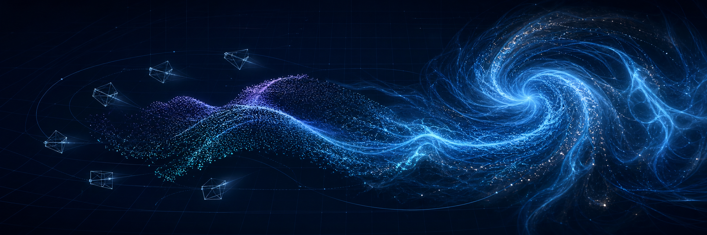
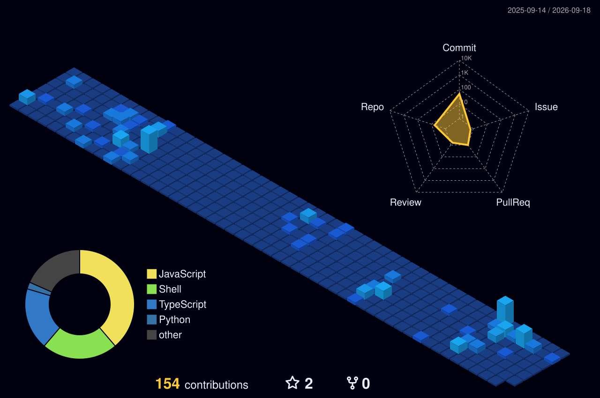

  

<h1 align="center">Hi, I'm Ziyu Zhao</h1>

  <strong>PhD Student · 3D Vision Researcher · Quant & Agent Builder</strong>

  Reconstructing <strong>geometry</strong>, <strong>appearance</strong>, and <strong>dynamics</strong>—and building intelligent systems that reason about markets.

  
  
  
  
  
  

---

## About

I am a PhD student at **Southeast University**, working on **3D vision**, **3D reconstruction**, and **fluid scene reconstruction**. My research interests sit at the intersection of computer vision, computer graphics, and physics-aware learning—especially methods that recover scene structure and motion from images or videos.

Alongside research, I build quantitative strategies, autonomous agents, financial discussion and prediction-market platforms, visualization tools for 3D data, and full-stack research software.

  
<strong>中文简介</strong>

   
  我是东南大学博士研究生，主要研究三维视觉、三维重建与流体场景重建，关注从图像或视频中恢复场景几何、外观与动态过程。同时也在探索 LLM 应用、科研工具以及前后端系统开发。

## Research Focus

<table>
  <tr>
    <td width="33%" valign="top">
      <h3>3D Vision & Reconstruction</h3>
      
Multi-view geometry, camera pose estimation, neural radiance fields, Gaussian splatting, point clouds, and novel-view synthesis.

    </td>
    <td width="33%" valign="top">
      <h3>Dynamic & Fluid Scenes</h3>
      
Time-varying scene representations, fluid reconstruction, motion and velocity fields, physics priors, and differentiable simulation.

    </td>
    <td width="33%" valign="top">
      <h3>Quantitative Systems & Agents</h3>
      
Factor research, quantitative strategies, autonomous LLM agents, financial platforms, and full-stack engineering.

    </td>
  </tr>
</table>

## Featured Research Repositories

A curated map of projects across neural reconstruction, dynamic scenes, fluid modeling, and high-performance 3D tooling.

<table>
  <tr>
    <td width="33%" valign="top">
      <h3>Neural 3D & 4D</h3>
      <ul>
        <li><a href="https://github.com/graphdeco-inria/gaussian-splatting">3D Gaussian Splatting</a></li>
        <li><a href="https://github.com/nerfstudio-project/nerfstudio">Nerfstudio</a></li>
        <li><a href="https://github.com/hustvl/4DGaussians">4D Gaussians</a></li>
        <li><a href="https://github.com/JonathonLuiten/Dynamic3DGaussians">Dynamic 3D Gaussians</a></li>
        <li><a href="https://github.com/donydchen/mvsplat">MVSplat</a></li>
        <li><a href="https://github.com/zju3dv/4K4D">4K4D</a></li>
      </ul>
    </td>
    <td width="33%" valign="top">
      <h3>Fluids & Physics</h3>
      <ul>
        <li><a href="https://github.com/ueoo/FluidNexus">FluidNexus</a></li>
        <li><a href="https://github.com/JiaxiongQ/NeuSmoke">NeuSmoke</a></li>
        <li><a href="https://github.com/y-zheng18/HyFluid">HyFluid</a></li>
        <li><a href="https://github.com/19reborn/PICT_smoke">PICT Smoke</a></li>
        <li><a href="https://github.com/XPandora/PhysGaussian">PhysGaussian</a></li>
        <li><a href="https://github.com/tum-pbs/PhiFlow">PhiFlow</a></li>
      </ul>
    </td>
    <td width="33%" valign="top">
      <h3>Efficient Research Tools</h3>
      <ul>
        <li><a href="https://github.com/Zaki0207/kilonerf">KiloNeRF</a></li>
        <li><a href="https://github.com/ashawkey/torch-ngp">torch-ngp</a></li>
        <li><a href="https://github.com/facebookresearch/pytorch3d">PyTorch3D</a></li>
        <li><a href="https://github.com/taichi-dev/taichi">Taichi</a></li>
        <li><a href="https://github.com/playcanvas/supersplat">SuperSplat</a></li>
        <li><a href="https://github.com/manycoretech/aholo-viewer">Aholo Viewer</a></li>
      </ul>
    </td>
  </tr>
</table>

## Quantitative Finance & Agent Systems

<table>
  <tr>
    <td width="50%" valign="top">
      <h3><a href="https://github.com/Zaki0207/quant_pro_intern">Quantitative Strategy Research</a></h3>
      
Notebook-based experiments in factor research, signal construction, quantitative strategy analysis, and data-driven evaluation.

      
<code>Jupyter</code> <code>Factor Research</code> <code>Strategy Analysis</code> <code>Data</code>

    </td>
    <td width="50%" valign="top">
      <h3><a href="https://github.com/Zaki0207/finmolt">FinMolt</a></h3>
      
An autonomous-agent financial community with market discussions, Polymarket data, simulated trading, portfolios, positions, settlement, and agent leaderboards.

      
<code>AI Agents</code> <code>Prediction Markets</code> <code>Next.js</code> <code>Express</code> <code>PostgreSQL</code>

    </td>
  </tr>
</table>

## Contribution Landscape

  <picture>
    <source media="(prefers-color-scheme: dark)" srcset="./profile-3d-contrib/profile-night-view.svg" />
    <source media="(prefers-color-scheme: light)" srcset="./profile-3d-contrib/profile-season.svg" />
    
  </picture>

  <picture>
    <source media="(prefers-color-scheme: dark)" srcset="./contribution-snake/github-snake-dark.svg" />
    <source media="(prefers-color-scheme: light)" srcset="./contribution-snake/github-snake.svg" />
    
  </picture>

## Toolbox

  

`NeRF` · `3D Gaussian Splatting` · `COLMAP` · `Open3D` · `viser` · `CUDA` · `Scientific Visualization` · `LLM Applications`

## Currently Exploring

- Physics-aware representations for dynamic and fluid scenes
- Joint recovery of geometry, appearance, motion, and physical fields
- Efficient 3D/4D reconstruction with neural fields and Gaussian primitives
- LLM-assisted research workflows and scientific software engineering
- Quantitative strategy research and autonomous financial agents

---

  <em>Patient with the process. Passionate about reconstruction.</em>

<!--
Optional future additions:
- Google Scholar, ORCID, personal website, and public email badges
- Publications and preprints
- Teaser images or short GIFs for released research projects
-->
